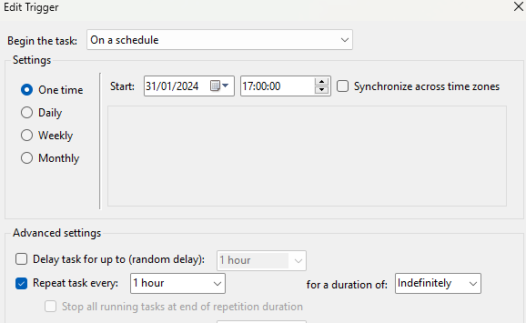
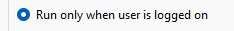

<div >
    
    
    <h1 align="center" > Theme-Changer - Python automatic theme changer for Windows </h1>
</div>

## About 

Windows 11 automatic dark/light mode changer with GUI written in python.

## Features

- GUI to select time of day in which you want light/dark mode to activate

- Select a wallpaper for each theme 

*Disclaimer: the script works by modifying two registry values, as a good habit you should always backup you registry before attempting any changes, it has been only tested locally as it's a bootleg personal project.*
## Why?

I just wanted a lazy way to change themes in Windows because apparently it's to hard for such a small indie company to add such function and took is as an opportunity to practice some python.

## Requirements

- Python installed in your system and the pillow module
- 'Accent Colors' option in the Personalization > Colors section of the Windows Settings app should be set to automatic.

<figure align="center">
    
    <figcaption style="text-align:center"></figcaption>
</figure>

## Usage

- Clone the repo and move it to the desired path, **both scripts should be in the same directory**.
```bash
git clone https://github.com/Alpharivs/theme-changer.git
```
- Run the GUI script for the initial setup or you compile it yourself with Pyinstaller.
```bash
python .\theme_changer.py
```
- Select the times and wallpapers that you want.

<figure align="center">
    
    <figcaption></figcaption>
</figure>
<figure align="center">
    
    <figcaption style="text-align:center"></figcaption>
</figure>

- Create a Scheduled Task to run the script I might update the program to create it automatically but for the time being a task the following settings:
    - Actions:
```
"start a program" action [path to your pythonw.exe] argument 'theme_changer_task.py' Start in [path to theme_changer_task.py*] *sans trailing \ C:\scripts

# You can get the path to your python.exe running python in the terminal and doing the following:
>>> import sys
>>> print(sys.executable)
The executable pythonw.exe should be inside the same directory
```
<figure align="center">
    
    <figcaption style="text-align:center"></figcaption>
</figure>

- Triggers:
```
A trigger set on schedule like the example below should do the trick, don't worry if it's not time to change theme the app will exit without trying to change anything!
```
<figure align="center">
    
    <figcaption style="text-align:center"></figcaption>
</figure>

**Make Sure that Run only when user is logged is checked as it modifies the HKCU and it wouldn't work otherwise and also check Run task as soon as... in case you miss the schedule (it might not run immediately due to how WTS works)**
<figure align="center">
    
    <figcaption style="text-align:center"></figcaption>
</figure>

<figure align="center">
    
    <figcaption style="text-align:center"></figcaption>
</figure>


<h2 align="center" > LVX-SIT </h2>
<h3 align="center" > MMDCCLXXVII -- Ab urbe condita </h3>